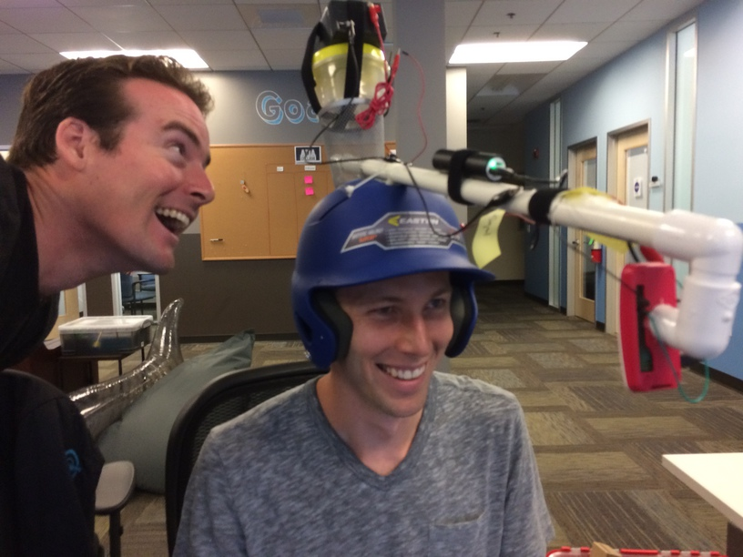
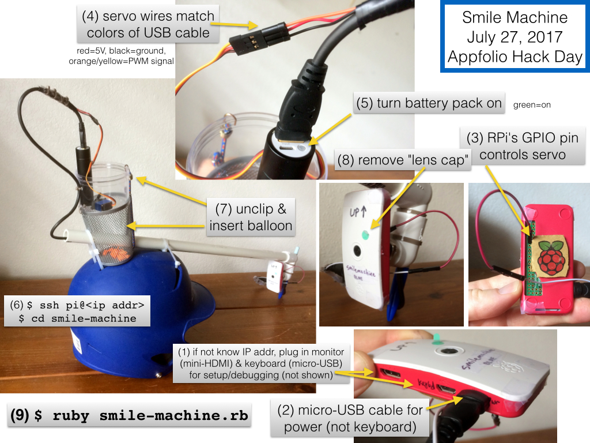

The Smile Machine
------------------

The Smile Machine is a pair of helmets for playing a verion of the childhood game of "[stare-down](https://en.wikipedia.org/wiki/Staring#Staring_contests)". 

Each player wears a helmet. Each helmet has a camera that watches the wearer's face. When the wearer smiles, the helmet pops a water balloon over the wearer. 

Figure 1: Smile Machines in action.

The Smile Machine was created for Appfolio Hack Day on July 27, 2017 ([blog post](https://www.appfolio.com/blog/2017/08/hack-day-2017-engineering-odyssey/)):

Table of Contents
------------------

- [How it works](#how-it-works)
- [Setup guide](#setup-guide)
- [Troubleshooting / Testing](#troubleshooting--testing)
- [Misc](#misc)

How it works
-----------------

The Raspberry Pi runs `smile-machine.rb`, in which a `while` loop executes the following logic:

1. Use `raspi-still` to take a 320-by-240 picture from the camera:

2. Base-64 encode that image and write it into a JSON request file `request.json` with this format:

        {"requests":[{
          "image":{"content": "your base64-encoded image here"},
          "features":[{"type": "FACE_DETECTION","maxResults": 1}]
        }]}

3. Use `curl` to send this JSON file to the Google Vision API:

        curl -s -H "Content-Type: application/json" --data-binary @request.json \
        "https://vision.googleapis.com/v1/images:annotate?key=<your api key here lol>"

    The API responds in 300-900 ms with a JSON response that includes a numeric estimate of the likelihood that the subject is smiling.

4. If the subject is smiling, change the duty-cycle of the pulse-width-modulated signal being sent to the servo, commanding the servo to rotate its arm, thrusting a pin into the balloon:

Setup guide
--------------

1. **Important:** You need to `ssh` into the Raspberry Pis in order to start the `smile-machine.rb` program, so you need to know their IP addresses (they will attempt to use hostnames `smilemachinered` and `smilemachineblue` but `ping smilemachinered` didn't work for me). Upon bootup, the Raspberry Pis attempt to join the network and request an IP address over DHCP. If the wireless network password has changed or you don't know the RPis' IP addresses, you should plug in a monitor and keyboard before powering the Pis so you can give them the wireless network password and figure out which IP address they've been given. Over HDMI, the Pi presents a console at boot; use `startx` to get a graphical environment, then click the network icon in the upper-right. 

2. Plug in the micro-USB cable to the power port of the RPi.

3. Plug in the one female wire to the exposed male pin sticking out of the I/O header in the back of the Pi.

4. Plug in the 3 servo wires to the exposed wires coming out of the USB cable, matching the colors. (black to brown, red to red, orange to light orange)

5. Push the little button on the battery pack to turn it on (it glows green when delivering power to the RPi).

6. Log in to the RPi (user: `pi`, password: written on the back of the helmet)

        $ ssh pi@<ip addr>
        $ cd smile-machine

7. Fill a water balloon to the size of a small orange, unclip bungee cord that's holding the cup down, tilt battery cup back, insert balloon in the silver wire balloon chamber, tilt battery cup forward, re-clip bungee cord.

8. Remove any post-it or sticker covering the lens

9. **When ready,** start the contest by executing 

        $ ruby smile-machine.rb

on both RPis at the same time. Use Ctrl-C to stop the programs as soon as one of the balloons pops.

**Important: when you run `smile-machine.rb`, the program will begin consuming Google Cloud credits. Do not leave it running for long!!**

**Warning:** currently the Raspberry Pis don't communicate, so if one RPi pops its balloon, the other RPi is still running, and could still soak the "winner" if he or she smiles, even after the contest is over. So as soon as one RPi pops a balloon, the moderator should Ctrl-C both RPis!

Troubleshooting / Testing
---------------------------

See the shell scripts in the `Tests` directory.

### Test: Camera takes pictures

    pi$ raspistill -w 320 -h 240 --nopreview -t 1 -o hi.jpg
    your-laptop$ scp pi@<ip addr>:/home/pi/smile-machine/hi.jpg . 
    your-laptop$ open hi.jpg

### Test: Servo arm stabs

Init PWM:

    pi$ gpio -g mode 18 pwm
    pi$ gpio pwm-ms
    pi$ gpio pwmc 192
    pi$ gpio pwmr 2000

Test stab:

    pi$ gpio -g pwm 18 100  # retract
    pi$ gpio -g pwm 18 150  # stab
    pi$ gpio -g pwm 18 100  # retract  
    pi$ gpio -g pwm 18 150  # stab
    pi$ gpio -g pwm 18 100  # retract

Test multiple stabs:

    pi$ gpio -g pwm 18 150 ; sleep .2 ; gpio -g pwm 18 100 ; sleep .2 ; gpio -g pwm 18 150 ; sleep .2 ; gpio -g pwm 18 100 ; sleep .2 ; gpio -g pwm 18 150 ; sleep .2 ; gpio -g pwm 18 100 ; sleep .2 ; gpio -g pwm 18 150 ; sleep .2 ; gpio -g pwm 18 100 ; sleep .2 ;

### Test: Google Vision API returns a valid response

Take a pic and make it into a request for the Google Vision API:

    pi$ raspistill -w 320 -h 240 --nopreview -t 1 -o pic.jpg
    pi$ base64 -w 0 pic.jpg > pic.jpg.b64
    pi$ cat > request.json << EOF
    {"requests":[{
      "image":{"content": "$(cat pic.jpg.b64)"},
      "features":[{"type": "FACE_DETECTION","maxResults": 1}]
    }]}
    EOF

Send the request to Google and verify you get a response with `joyLikelihood` in it:

    pi$ curl -s -H "Content-Type: application/json" --data-binary @request.json "https://vision.googleapis.com/v1/images:annotate?key=$(cat ~/google-api-key.txt)"
    {
      "responses": [
        {
          "faceAnnotations": [
            {
              "boundingPoly": {
                "vertices": [
                  {
                    "x": 74,
                    "y": 31
                  },
                  {
                    "x": 226,
                    "y": 31
                  },
    ...
              "rollAngle": 10.525506,
              "panAngle": 13.529788,
              "tiltAngle": -24.843842,
              "detectionConfidence": 0.95072544,
              "landmarkingConfidence": 0.26536825,
              "joyLikelihood": "VERY_LIKELY",
              "sorrowLikelihood": "VERY_UNLIKELY",
              "angerLikelihood": "VERY_UNLIKELY",
              "surpriseLikelihood": "VERY_UNLIKELY",
              "underExposedLikelihood": "VERY_UNLIKELY",
              "blurredLikelihood": "VERY_UNLIKELY",
              "headwearLikelihood": "VERY_LIKELY"
            }
          ]
        }
      ]
    }

Misc
-----

- The servo is controlled by a pulse-width-modulated (PWM) signal -- a periodic train of pulses. The width of the pulses encodes the desired angle of the servo arm. 
    - `pwmc` is for "clock" and `pwmr` is for "range": [This Adafruit tutorial](https://learn.adafruit.com/adafruits-raspberry-pi-lesson-8-using-a-servo-motor/software) explains that the PWM freq is `19.2 MHz / pwmc / pwmr`; so setting pwmc to 192 and pwmr to 2000 yields a 50 kHz PWM signal, good for servos. 
    - `gpio -g pwm 18 100` sets the PWM pulse to 1 ms, which sets the servo arm all the way in one direction (retract stabber).
    - `gpio -g pwm 18 150` sets the PWM pulse to 1.5ms, puts the servo arm in the middle
    - `gpio -g pwm 18 200` sets the PWM pulse to 2 ms, DON'T DO THIS, it'll smash the servo arm into the bottom of the cup and tear the servo off the cup.
- We use small water balloons from K-Mart: bigger than an egg, smaller than an apple.
- Google Cloud Quota
    - 40 requests: no change in the $300 credit. So, seems pretty cheap to run this thing.
    - https://console.cloud.google.com/apis/dashboard?project=smile-machine&duration=P1D
    - 1 year Google Cloud trial ends Feb 9, 2019.

